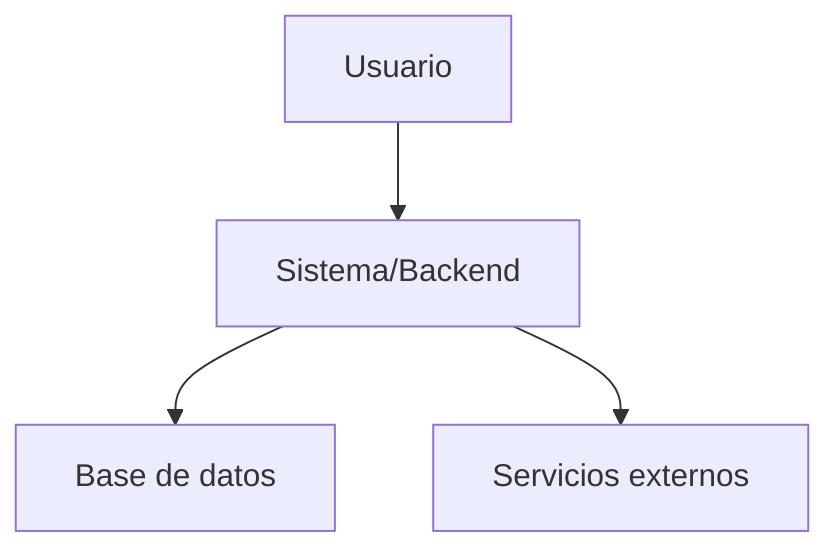

<%*  
let d = tp.date.now("YYYYMMDDHHmm");

// Tipo de nota seleccionado  
const tipo = await tp.system.suggester(  
["Nota atómica", "Nota de curso", "Proyecto técnico"],  
["atomica", "curso", "proyecto"]  
);  
tR += `> **Tipo de nota:** ${tipo}\n\n`;  
%>

# 🧠 <% tp.file.title %>

**ID:** `<% d %>`  
**Fecha:** <% tp.date.now("YYYY-MM-DD") %>  
**Tipo:** <% tipo %>

---

# 🟦 Contexto inmediato

- Fuente / Inspiración:
    
- Situación / Estímulo:
    

---

<%* if (tipo === "atomica") { %>

# 🟩 Idea principal atómica

> _(Escribe aquí la idea mínima y autocontenida)_

## 🧩 Explicación breve

## 🟨 Futuras vías de desarrollo

<%* } else if (tipo === "curso") { %>

# 🎓 Nota de curso

**Curso:**  
**Módulo / Lección:**  
**Profesor / Plataforma:**

## 🎯 Objetivo de aprendizaje

## 🧠 Conceptos clave

## 📘 Desarrollo / Explicación

## 🧪 Ejemplos / Código

```
(Añade aquí ejemplos o código)
```

## 📝 Ejercicios / Tareas

## ❓ Dudas pendientes

<%* } else if (tipo === "proyecto") { %>

# 🛠️ Proyecto técnico

**Estado:** Idea | En desarrollo | En pausa | Terminado  
**Stack tecnológico:**  
**Última actualización:** <% tp.date.now("YYYY-MM-DD") %>

## 🎯 Objetivo del proyecto

## 📋 Requerimientos funcionales

## 📋 Requerimientos no funcionales

## 🧩 Arquitectura general



## 🧱 Estructura técnica

### Tecnologías:

### Módulos / Componentes:

### Dependencias:

## 💾 Diseño de datos

## 🔐 Seguridad

- Riesgos:
    
- Controles:
    

## 🧪 Plan de pruebas

## 📈 Roadmap

- [ ]
    
- [ ]
    
- [ ]
    

<%* } %>

---

# 🧠 Conexiones con conocimiento previo

---

# 🔑 Palabras clave

---

# 🏷️ Etiquetas

#Zettelkasten

---

# 🔗 Enlaces internos sugeridos